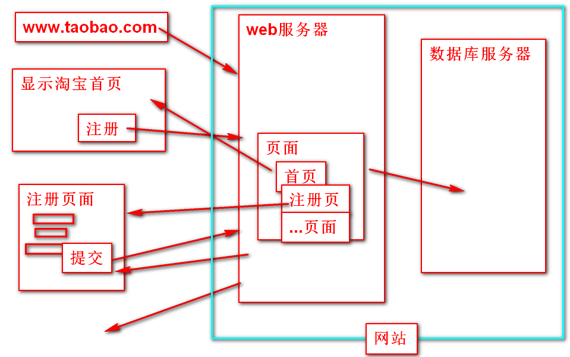
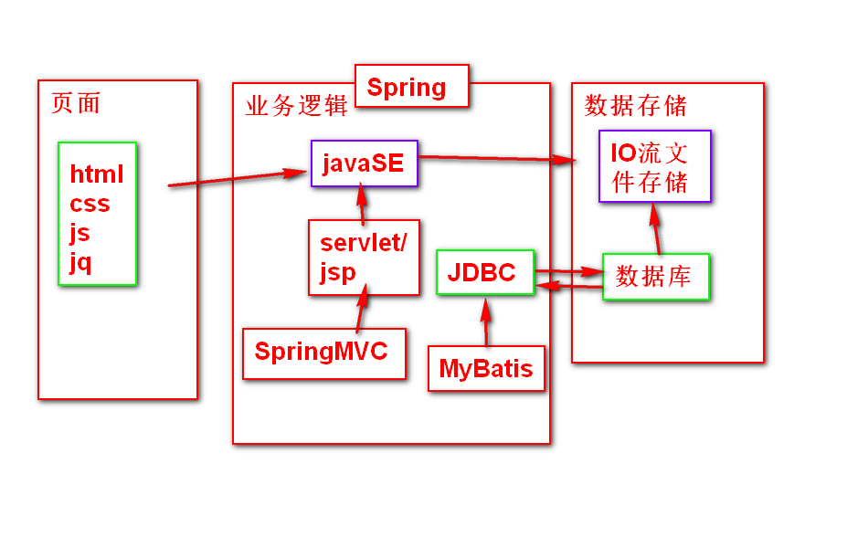

##自我介绍
刘国斌 

###学完之后找什么样的工作， java软件开发工程师

	工作后开发软件，开发具备网络访问能力的软件，软件的作用：共享数据（文本，音频，视频，图片）

###服务器 
- 什么是服务器：一台高配置的电脑 
1. 邮件服务器：在一台高配置电脑上安装了提供邮件服务的软件，提供收发邮件的功能
2. ftp服务器：在一台高配置电脑上安装了提供共享文件服务的软件，提供文件上传下载的功能
3. web服务器：在一台高配置电脑上安装了提供web服务的软件，提供数据共享，并且可以添加各种复杂的业务逻辑
4. 数据库服务器：在一台高配置电脑上安装了提供数据服务的软件，提供数据的增删改查功能

###开发网站的类型
资讯类：网易  今日头条  腾讯新闻
视频类：爱奇艺  优酷 
音频类：网易云音乐 酷狗 qq音乐
生活类：58和赶集   链家   
电商类：淘宝  京东

###开发的网站包含哪些内容
- 包含三大类：
1. 页面
2. 业务逻辑
3. 数据存储

###网站架构
- BS： Browser Server 浏览器-服务器 
1. 优点：跨平台，不用下载客户端，升级方便
2. 缺点：响应速度较慢，功能较少
- CS: Client Server 客户端-服务器
1. 优点：操作方便，因为客户端本身存在一部分数据所以请求服务器时数据量相比较BS要少，所以访问速度要快，功能丰富 cs架构可以提高用户体验度
2. 缺点：功能升级需要下载新版本，开发成本高

- BS架构需要咱们Java程序员做那些事儿呢？
1. 开发页面
2. 提供数据
- CS架构需要咱们Java程序员做那些事儿呢？
1. 提供数据

####总结：会了BS 就会了CS  

####Java课程体系介绍

###时间介绍
1. 页面阶段 13天 

2. 数据库阶段 8天

###页面阶段的内容 

1. html： 用来勾勒出网页的结构和内容       （骨架+肉）
2. css ： 用来美化页面                    (化妆,美颜,整容)
3. JavaScript： 用来让页面呈现动态的效果    （添加动态行为）
4. jQuery： 用来简化JavaScript操作 

###HTML
-  HyperText Markup Language 超文本标记语言：最简单的语言，用来进行网页制作

- 超文本：指不仅仅包含文本，还包含颜色，字体，图片，音视频等

- 学习HTML主要学习几种固定的标签，还有标签有哪些属性，标签和标签间的嵌套关系

###因为不同的浏览器可能存在兼容性问题，为了保证效果一直 使用Chrom浏览器(谷歌浏览器)

###创建第一个HTML文件
	
	    <!DOCTYPE html>
    <!-- 文档声明，告诉浏览器使用html的哪套标准去解析内容 
    	上面的写法是告诉浏览器用最新的html5的标准去解析
    -->
    <html><!-- 根标签 -->
    	<head><!-- 头标签 里面的内容不是给用户看的
    			  是给浏览器看的 -->
    		<meta charset="UTF-8">
    		<!-- 告诉浏览器使用什么字符编码解析内容 -->
    		<!-- 设置页面的标题 有利于seo优化 -->
    		<title>Insert title here</title>
    		<!-- 关键字也是进行seo优化的 
    		为了让搜索引擎能找得到自己-->
    		<meta name="keywords" 
    			content="宠物医院,大钟寺宠物医院">
    	</head>
    	<body><!-- 内容体，里面写给用户看的内容 -->
    		helloworld
    	</body>
    </html>
    
- html标签结构
	
	<!DOCTYPE html>
	<html>
		<head></head>
		<body></body>
	</html>

###HTML中常见的标签

1. 文本标签
	
	标题<h1></h1> --- <h6></h6>

	段落标签：

	水平线

####简历练习
	
    <body>
    <h1 align="center">个人简历</h1>
    <h2>基本信息</h2>
    
姓名：钢铁侠

    
性别：男

    
爱好: 拯救世界

    

    <h2>个人经历</h2>
    
担任某上市公司CEO

    
被恐怖分子抓走后制造了第一代盔甲

    
    
    </body> 

###列表标签

#### 定义列表（层级列表）
- dl: define list 定义列表
- dt: define title 定义标题
- dd: define data 定义数据
    <dl><!-- define list 定义列表 -->
    	<dt>一级标题</dt><!-- define title 定义标题 -->
    	<dd>数据内容</dd><!-- define data 定义数据 -->
    	<dd>数据内容</dd>
    	<dd>数据内容</dd>
    	<dt>一级标题</dt>
    	<dd>数据内容</dd>
    	<dd>数据内容</dd>
    	<dd>数据内容</dd>
    </dl>
####无序列表
- ul  unordered list 无序列表
- li  list item  列表项
    
    	<h2>无序列表</h2>
    	<ul type="none"> <!-- type控制显示样式 none：没有样式
    		disc：默认实心圆，circle：空心圆 --> 
    	<li>列表项1</li>
    	<li>列表项2</li>
    	<li>列表项3</li>
    	</ul>
    
    	<h2>掌握技能</h2>
    	<ul>
    	<li>英语八级</li>
    	<li>胸口碎大石</li>
    	<li>最强王者</li>
    	<li>把把吃鸡</li>
    	</ul>

####有序列表
- ol order list 有序列表
- li list item  列表项

    	    <h2>有序列表</h2>
    		<ol type="a">  <!--type的值：
    		1:默认 数字，a：小写字母,A：大写字母,
    		i：小写罗马字母,I：大写罗马字符  -->
    		<li>列表项1</li>
    		<li>列表项2</li>
    		<li>列表项3</li>
    		</ol>
    		<h2>把大象装冰箱分几步</h2>
    		<ol start="5">
    		<li>打开冰箱门</li>
    		<li>把大象装进去</li>
    		<li>把冰箱门关上</li>
       	 	</ol>

####列表的嵌套

	    <h2>列表嵌套菜单</h2>
    
    	<ul>
    	<li>凉菜</li>
    	<ol>
    		<li>拍黄瓜</li>
    		<li>老醋花生</li>
    	</ol>
    	<li>炒菜</li>
    	<ol>
    		<li>烧茄子</li>
    		<li>西红柿炒鸡蛋</li>
    	</ol>
    	<li>炖菜</li>
    	<ol>
    		<li>水煮肉片</li>
    		<li>东北乱炖</li>
    	</ol>
    	</ul>
    
####练习：三层嵌套 实现如下效果
    
	1. java基础
    	变量
    	数据类型
    	运算符
    	流程控制
    		if
    		switch
    		while
    		for
    2. 面向对象
    3. JavaAPI

- 实现代码：
	   
		 <h2>课程介绍</h2>
    	<ol>
    	<li>java基础</li>
    		<ul>
    			<li>变量</li>
    			<li>数据类型</li>
    			<li>运算符</li>
    			<li>流程控制</li>
    				<ul>
    					<li>if</li>
    					<li>switch</li>
    					<li>while</li>
    				</ul>
    		</ul>
    	<li>面向对象</li>
    	<li>javaAPI</li>
    	</ol>
    
    
    	<h2>订单管理</h2>
    	<ul>
    	<li>我的订单</li>
    		<ul>
    			<li>全部订单</li>
    			<li>代付款</li>
    			<li>待收货</li>
    			<li>待评价</li>
    			<li>退货退款</li>
    		</ul>
    	<li>我的优惠券</li>
    	<li>收货地址</li>
    		<ul>
    			<li>地址管理</li>
    		</ul>
    	<li>账号管理</li>
    		<ul>
    			<li>我的信息</li>
    			<li>安全管理</li>
    		</ul>
    	</ul>

###分区标签（元素）
		
		用来装显示的内容的，元素本身没有显示效果，使用分区标签将页面内容分为几块，好处是便于对内容批量管理

- div: 独占一行
- span: 一行可以有多个

	    
头部内容

    	
正文内容

    	
尾部内容

- html5的标准中有新增了几个分区标签 为了提高代码的可读性
1. header 头
2. article 文章/正文
3. footer 脚

	    <header>头部内容</header>
    	<article>正文内容</article>
    	<footer>尾部内容</footer>

###标签（元素）分类
1. 块级元素： 独占一行的元素
	-例如：
		div,p,h1-6, hr
2. 行内元素： 可以和其它行内元素共占一行的元素
	-例如：
		span，
		<i></i>和<em></em>  斜体
		<b></b>和<strong></strong 字体加粗
		<u></u> 下划线
		<del></del>和<s></s>删除线

- 行内元素的空格折叠现象，多个空格会合并成一个空格 如果需要显示多个空需要使用： &nbsp;

####常见特殊字符
    - 空格： &nbsp;
    - <:  &lt;
    - >:  &gt;
    - 换行:  

###图片标签
- 常见属性：
1. alt： 当图片不能正常显示的时候显示的文本
2. src: 图片的路径   
	-相对路径
	-绝对路径
3. title: 当鼠标在图片是悬停的时候显示的文本
4. width/height: 控制图片的宽高

	    <!-- alt:当图片不能正常显示的时候显示的文本 
    	src:图片的路径
    	1. 相对路径：相对于当前的页面文件，如果是同级文件直接写文件名
    		如果是上级文件则 ../文件名  如果是下级 文件夹名/文件名
    	2. 绝对路径：完整路径，
    	如果访问的图片是站外资源则必须使用绝对路径, 
    	这种称为盗链，好处不占自家资源，
    	坏处 人家换地址 自己就不显示了
    	-->
    	
    	
    	

    	<!-- title：鼠标悬停在图片上时显示的内容 -->
    	<!-- width/height:设置图片的宽高，单位为px像素 或百分比
    		如果只设置宽 则高度会按照原比例缩放
    	 -->
    	

- 支持的图片格式：
1. jpg 	不支持透明色
2. png  支持透明色
3. gif  动图

邮箱：bjliugb@tedu.cn

qq:77331283
  

